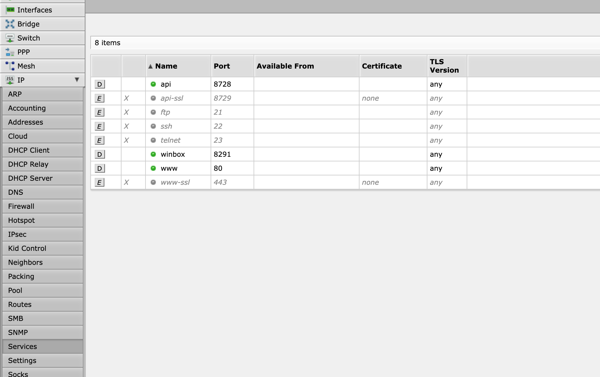
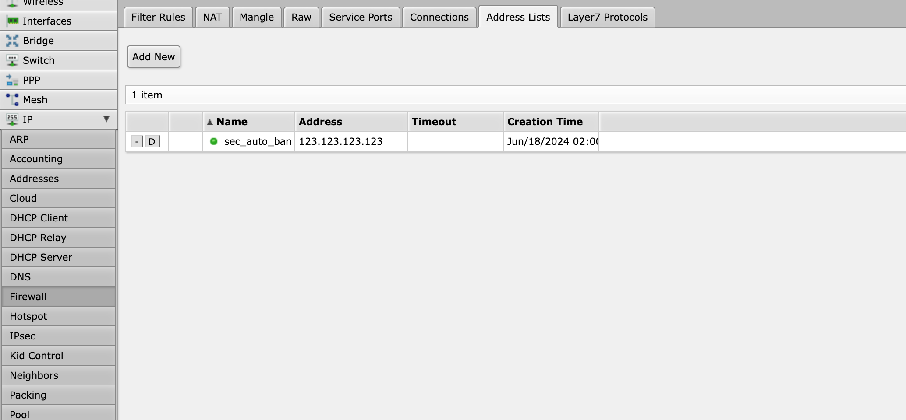

# RouterOS

RouterOS封禁模块

## 下载模块

```
wget https://raw.githubusercontent.com/sec-report/SecAutoBan/main/device/block/router_os/router_os.py
```

## 配置RouterOS

### 开启API

登录RouterOS管理后台，开启`IP`-`Services`-`api`



### 创建Address Lists

导航至：`IP`-`Firewall`-`Address Lists`。添加一条Address，其中Name为`sec_auto_ban`，IP填写一个不存在的即可。



### 创建防火墙规则

导航至：`IP`-`Firewall`-`Filter Rules`添加两条规则，分别丢弃来源和目的IP是Address Lists中的IP。

丢弃来源IP：


丢弃目的IP：


## 配置模块

### 安装依赖

```
pip3 install SecAutoBan RouterOS-api
```

#### 修改回连核心模块配置

更改脚本第`82`-`84`行

```
server_ip = "127.0.0.1",
server_port = 8080,
sk = "sk-xxx",
```

#### 修改RouterOS配置

更改脚本第`73`-`80`行

```
routeros_config = {
    "host": "",  # 与RouterOS连接的IP
    "port": 8728,  # 默认端口8728，如自定义请修改
    "username": "admin",  # 用户名
    "password": "",  # 密码
    "plaintext_login": True,  # 适用于 RouterOS 6.43 及更高版本
    "list_name": "sec_auto_ban"  # 与Address Lists name保持一致，正常情况无需修改
}
```

## 运行

```shell
python3 router_os.py
```
